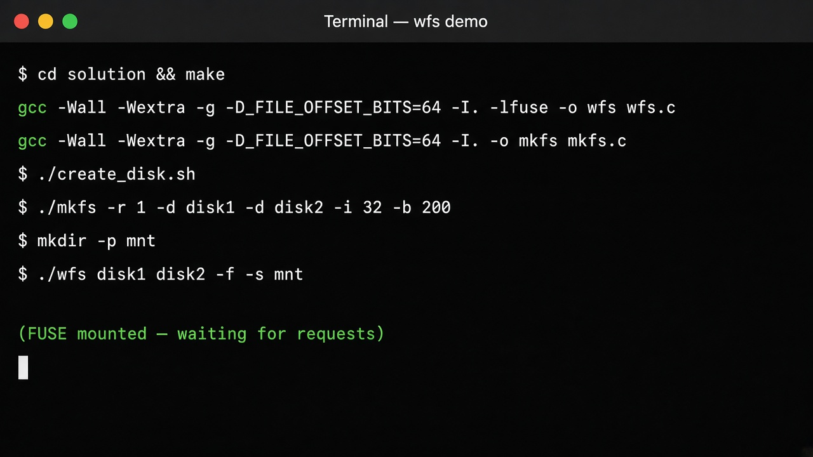
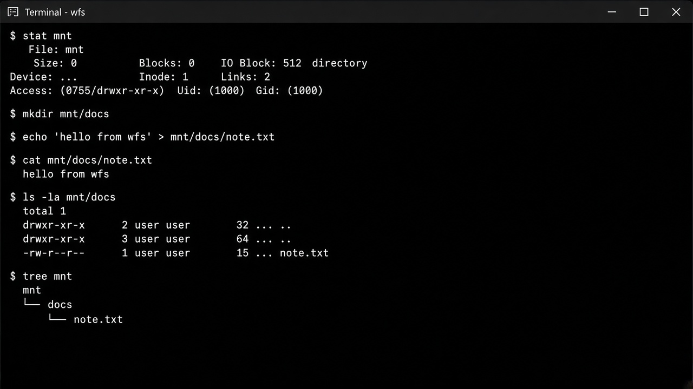
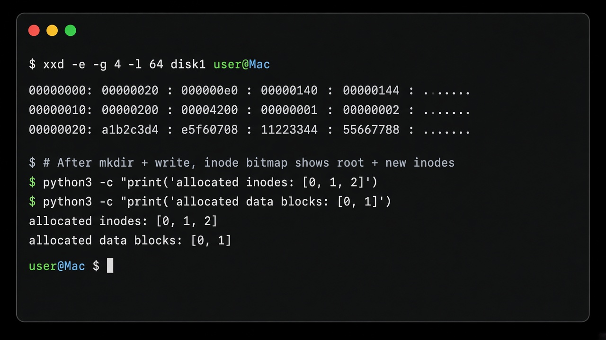

# Project Description

This document explains the FUSE-based RAID filesystem in depth: what it is, how it is structured on disk, how `mkfs` and `wfs` work together, which OS and storage concepts it uses, and how common file operations map onto those structures.

**Section 3** is a visual walkthrough with screenshots, a real terminal session, and code snippets from the implementation.

---

## 1. What this project is

This project implements a **complete miniature filesystem** that runs entirely in **userspace** via **FUSE** (Filesystem in Userspace). Instead of writing a Linux kernel module, the filesystem is a normal C program (`wfs`) that:

1. Opens one or more **disk image files** (regular files that pretend to be disks)
2. Maps them into memory with `mmap`
3. Registers callbacks with libfuse (`getattr`, `read`, `write`, `mkdir`, …)
4. Translates every VFS-style request from the kernel into reads and writes against those images

A separate program, `mkfs`, **formats** empty images into a valid empty filesystem (superblock, bitmaps, root directory inode) before anything can be mounted.

The filesystem is **RAID-only**: it always spans at least two disks, and every format chooses one of:

| Mode | Flag | Idea |
|------|------|------|
| RAID 0 | `-r 0` | Stripe data blocks across disks for capacity/throughput; **no** redundancy for data |
| RAID 1 | `-r 1` | Mirror all data and metadata on every disk |
| RAID 1v | `-r 1v` | Same layout as RAID 1, but reads **verify** copies and take a majority vote |

Metadata (superblock region logic, inode bitmap, inodes) is **always mirrored**, even in RAID 0. Only **file/directory data blocks** are striped in RAID 0. That mirrors how some real systems separate metadata protection from data placement.

Conceptually this sits between:

- **Teaching filesystems** like the ones in OSTEP / xv6 / FFS lectures (inodes, bitmaps, direct + indirect blocks)
- **Production ideas** from Btrfs/ZFS and `md`-RAID (RAID at or above the block layer, multi-device awareness)

---

## 2. High-level architecture

```text
  User tools (ls, cat, echo, mkdir, rm, …)
                 │
                 ▼
        Linux VFS (kernel)
                 │  FUSE protocol
                 ▼
        libfuse → wfs callbacks
                 │
                 ▼
     In-memory view of disk images (mmap)
                 │
        ┌────────┴────────┐
        ▼                 ▼
   disk1.img          disk2.img  …  (RAID 0 / 1 / 1v placement)
```

**Two binaries:**

| Binary | Role in the lifecycle |
|--------|------------------------|
| `mkfs` | One-shot formatter. Writes initial on-disk structures. Does not stay running. |
| `wfs` | Long-lived FUSE daemon. Serves the mount point until unmounted. |

**Typical lifecycle:**

1. Create empty image files (`truncate` / `dd` / `create_disk.sh`)
2. Run `mkfs -r … -d … -i … -b …` to write the empty FS
3. `mkdir mnt && ./wfs disk1 disk2 -f -s mnt`
4. Use normal Unix commands against `mnt/…`
5. `fusermount -u mnt` (or `./umount.sh mnt`)

While mounted, changes are persisted through the mmap/`MAP_SHARED` mapping back into the image files, so unmounting (and even crashing after writes are flushed by the kernel) leaves a durable filesystem state on disk.

---

## 3. Walkthrough: what it looks like when you run it

The screenshots and session log below were taken from a real Linux run of this repo (RAID 1, two 1MB disk images). Ordinary tools (`stat`, `mkdir`, `echo`, `cat`, `ls`, `tree`) talk to the kernel; FUSE forwards those calls into `wfs`.

### 3.1 Build, format, and mount



```bash
cd solution
make
./create_disk.sh
./mkfs -r 1 -d disk1 -d disk2 -i 32 -b 200
mkdir -p mnt
./wfs disk1 disk2 -f -s mnt   # -f = foreground, -s = single-threaded
```

What each step does:

| Step | Effect |
|------|--------|
| `make` | Builds `mkfs` and `wfs` |
| `create_disk.sh` | Creates zeroed `disk1` / `disk2` (1MB each) |
| `mkfs …` | Writes superblock, bitmaps, and root inode onto both images |
| `./wfs … mnt` | Mounts the RAID set at `mnt/`; blocks until unmounted if `-f` is used |

Layout offsets are computed in `mkfs` like this:

```c
/* Superblock and bitmaps are contiguous (no padding between them). */
sb.i_bitmap_ptr = (off_t)sizeof(struct wfs_sb);
sb.d_bitmap_ptr = sb.i_bitmap_ptr + (off_t)(sb.num_inodes / 8);
/* Inodes and data blocks are block-aligned. */
sb.i_blocks_ptr = (off_t)BKROUNDUP(sb.d_bitmap_ptr + sb.num_data_blocks / 8);
sb.d_blocks_ptr = sb.i_blocks_ptr + (off_t)(sb.num_inodes * BLOCK_SIZE);
```

### 3.2 Using the mounted filesystem

Open a **second** terminal while `wfs` is running (especially with `-f`). From the project’s `solution/` directory:



Captured session (real output):

```text
$ stat mnt
  File: mnt
  Size: 0               Blocks: 0          IO Block: 4096   directory
Device: 2eh/46d Inode: 1           Links: 2
Access: (0755/drwxr-xr-x)  Uid: ( 1000/ student)   Gid: ( 1000/ student)

$ mkdir mnt/docs
$ mkdir mnt/docs/notes
$ echo "hello from wfs" > mnt/docs/notes/hello.txt
$ echo "RAID1 mirrored data" > mnt/docs/readme.txt

$ cat mnt/docs/notes/hello.txt
hello from wfs

$ ls -la mnt/docs
total 2
drwxrwxr-x 3 student student 64 ... .
drwxr-xr-x 3 student student 64 ... ..
drwxrwxr-x 2 student student 32 ... notes
-rw-rw-r-- 1 student student 20 ... readme.txt

$ tree mnt
mnt
|-- docs
|   |-- notes
|   |   `-- hello.txt
|   `-- readme.txt
`-- small.bin

2 directories, 3 files

$ stat mnt/docs/notes/hello.txt
  File: mnt/docs/notes/hello.txt
  Size: 15              Blocks: 1          IO Block: 4096   regular file
Access: (0664/-rw-rw-r--)  Uid: ( 1000/ student)   Gid: ( 1000/ student)
```

Those `stat` fields come straight from the on-disk inode via `wfs_getattr`:

```c
static int wfs_getattr(const char *path, struct stat *stbuf)
{
    memset(stbuf, 0, sizeof(*stbuf));
    int inum = path_to_inode(path);
    if (inum < 0) {
        return -ENOENT;
    }
    struct wfs_inode *ino = inode_at(0, inum);
    stbuf->st_uid = ino->uid;
    stbuf->st_gid = ino->gid;
    stbuf->st_atim.tv_sec = ino->atim;
    stbuf->st_mtim.tv_sec = ino->mtim;
    stbuf->st_mode = ino->mode;
    stbuf->st_size = ino->size;
    stbuf->st_nlink = (nlink_t)ino->nlinks;
    return 0;
}
```

FUSE dispatches into that (and the other ops) through the operations table:

```c
static struct fuse_operations ops = {
    .getattr = wfs_getattr,
    .mknod   = wfs_mknod,
    .mkdir   = wfs_mkdir,
    .unlink  = wfs_unlink,
    .rmdir   = wfs_rmdir,
    .read    = wfs_read,
    .write   = wfs_write,
    .readdir = wfs_readdir,
};
```

### 3.3 Peeking at the raw disk image

After `mkfs` (and later after creates/writes), the image is just a file—you can inspect it with `xxd`:



Real hex dump of the start of `disk1` after format (little-endian 32-bit groups):

```text
$ xxd -e -g 4 -l 80 disk1
00000000: 00000020 00000000 000000e0 00000000  ................
00000010: 00000140 00000000 00000144 00000000  @.......D.......
00000020: 00000200 00000000 00004200 00000000  .........B......
00000030: 00000001 00000002 ................  raid_mode=1, num_disks=2
```

Decoded (for `-i 32 -b 200` → 224 data blocks after rounding):

| Field | Value (example) | Meaning |
|-------|-----------------|---------|
| `num_inodes` | 32 (`0x20`) | inode capacity |
| `num_data_blocks` | 224 (`0xe0`) | data-block capacity |
| `i_bitmap_ptr` | 320 (`0x140`) | right after extended superblock |
| `d_bitmap_ptr` | 324 (`0x144`) | after 32/8 = 4-byte inode bitmap |
| `i_blocks_ptr` | 512 (`0x200`) | inode table (block-aligned) |
| `d_blocks_ptr` | 16896 (`0x4200`) | start of data region |
| `raid_mode` | 1 | RAID 1 |
| `num_disks` | 2 | mirrored pair |

### 3.4 What happens under the hood for a write

When you run `echo "hello from wfs" > mnt/docs/notes/hello.txt`, the path roughly becomes:

```text
echo  →  write(2)  →  VFS  →  FUSE  →  wfs_write()
                                      ├─ path_to_inode("/docs/notes/hello.txt")
                                      ├─ inode_get_block(..., create=1)
                                      │    └─ allocate_data_block() + update bitmap
                                      └─ write_data_block()   # RAID-aware
```

RAID-aware block I/O (simplified from `wfs.c`):

```c
static void write_data_block(size_t log_idx, const void *src)
{
    if (raid_mode == RAID_0) {
        int d; off_t off;
        map_data_block(log_idx, &d, &off);   /* disk = log_idx % num_disks */
        memcpy(disk_at(d) + off, src, BLOCK_SIZE);
        return;
    }
    /* RAID 1 / 1v: mirror to every disk */
    for (int d = 0; d < num_disks; d++) {
        memcpy(disk_at(d) + sb->d_blocks_ptr + (off_t)log_idx * BLOCK_SIZE,
               src, BLOCK_SIZE);
    }
}
```

RAID 1v reads compare all copies and take a majority (tie → lowest disk index):

```c
/* RAID 1v: majority vote across disks; ties -> lowest index. */
for (int d = 0; d < num_disks; d++) {
    memcpy(copies[d], disk_at(d) + ... + log_idx * BLOCK_SIZE, BLOCK_SIZE);
}
/* pick copy with highest agreement count; first index wins ties */
```

### 3.5 Unmount

```bash
./umount.sh mnt
# equivalent: fusermount -u mnt
```

After unmount, `mnt/` is an ordinary empty directory again, but `disk1` / `disk2` still hold the filesystem. Remounting with `./wfs disk1 disk2 -s mnt` restores the same tree (`docs/`, `hello.txt`, …).

Also see the on-disk diagram: [`disk-layout.svg`](disk-layout.svg).

---

## 4. Core concepts used

### 4.1 Block-based storage

Everything is organized around a fixed **block size of 512 bytes**.

- Addresses and allocations are in whole blocks (or offsets that are multiples of 512 for inodes/data).
- A file’s byte offset `O` lives in file-relative block `O / 512`, at offset `O % 512` inside that block.
- Reads and writes that cross block boundaries are split into per-block pieces.

This is the same abstraction disks and classic Unix filesystems have used for decades: the filesystem never thinks in “infinite byte arrays”; it thinks in numbered blocks plus a bit of bookkeeping.

### 4.2 Superblock

The **superblock** is the filesystem’s header. It lives at offset 0 of each disk image and answers:

- How many inodes and data blocks exist?
- Where do the inode bitmap, data bitmap, inode table, and data region start?
- What RAID mode was chosen, how many disks, and how do we identify each disk?

Without a valid superblock, nothing else can be interpreted.

### 4.3 Bitmaps (allocation maps)

Two bitmaps track free vs used resources:

- **Inode bitmap** — one bit per inode
- **Data block bitmap** — one bit per data block

Setting a bit means “allocated.” Clearing it means “free.” Allocation walks the bitmap for a clear bit, sets it, and initializes the corresponding structure. Freeing reverses that.

This is intentionally simple (linear scan). Real filesystems use freelists, buddy allocators, or B-trees; the interface—find free, mark used—is the same idea.

### 4.4 Inodes

An **inode** stores everything about a file or directory *except* its name:

- Type and permissions (`mode`: directory vs regular file, `rwx` bits)
- Owner (`uid` / `gid`)
- Size in bytes
- Link count (`nlinks`)
- Timestamps (access / modify / change)
- Pointers to data blocks (`blocks[]`)

Names live in **directory entries**, which map `name → inode number`. That separation is why hard links are possible in Unix (multiple names, one inode); this project mostly uses a single name per file but still stores `nlinks` correctly for directories (`.` / `..` semantics).

**Important layout rule:** each inode occupies a **full 512-byte slot** on disk (block-aligned). Inodes are not packed tightly. The struct is smaller than 512 bytes; the rest of the block is unused padding.

### 4.5 Direct and indirect block pointers

Each inode has `N_BLOCKS = 8` pointers:

| Index | Role |
|-------|------|
| `0 .. 5` (`D_BLOCK = 6`) | **Direct** pointers to data blocks |
| `6` (`IND_BLOCK`) | Pointer to a single **indirect** block |

**Direct:** the inode points straight at a data block that holds file bytes (or directory entries).

**Indirect:** the inode points at a block that itself is an array of pointers (`off_t` values) to further data blocks. That multiplies max file size:

- Direct only: `6 × 512 = 3072` bytes
- With one indirect block of `512 / sizeof(off_t)` pointers (typically 64 on LP64): up to `6 + 64` data blocks → tens of KB in this toy FS

Directories in this project **do not use the indirect pointer**—only the six direct blocks—so a directory’s entry capacity is capped by those blocks.

Empty pointers are represented as `-1` (direct slots) or `0` / `-1` in indirect tables after zero-fill.

### 4.6 Directories as files

A directory is an inode with `S_IFDIR` set. Its “file contents” are an array of **directory entries**:

```c
struct wfs_dentry {
    char name[MAX_NAME];  /* up to 28 chars */
    int  num;             /* inode number */
};
```

Each entry is 32 bytes → **16 entries per 512-byte block**.

Blank entries (empty name) may appear inside the region covered by `inode.size`. Lookup skips blanks; create may reuse a blank slot or append and grow `size`.

Path resolution walks components: start at inode 0 (root), look up `"a"` in root, then `"b"` in that directory, and so on for path `/a/b`.

### 4.7 FUSE and the VFS

Linux applications never talk to `wfs` directly. They use syscalls (`open`, `read`, `stat`, …). The kernel’s **VFS** dispatches those to the FUSE driver, which forwards them to userspace callbacks registered in `struct fuse_operations`.

That means:

- Implementing `wfs_getattr` makes `stat` work
- Implementing `wfs_readdir` makes `ls` work
- Implementing `wfs_write` makes `echo hi > file` work

FUSE options used here:

- `-s` — single-threaded (simpler; no locking between callbacks)
- `-f` — foreground (logs and debugger-friendly; doesn’t daemonize)

`wfs` must **strip its own arguments** (disk image paths) before calling `fuse_main`, leaving only FUSE options and the mount point.

### 4.8 RAID at the filesystem layer

RAID can live in hardware, in the block layer (`mdadm`), or inside the filesystem. This project puts RAID **inside the FS**:

- Placement policy knows about multiple images
- Metadata policy (always mirror) can differ from data policy (stripe vs mirror)

**RAID 0 — striping (data only)**  
Logical data block index `i` maps to:

- disk = `i % num_disks`
- byte offset on that disk = `d_blocks_ptr + i * BLOCK_SIZE`

Only that disk’s data-bitmap bit for `i` is set. Across the array, allocated bits **sum** to the number of logical blocks in use.

**RAID 1 — mirroring**  
Every write of a data block (and all metadata updates) is copied to **all** disks. Bitmaps and inode regions stay identical. Reads can use disk 0 (or any copy).

**RAID 1v — verified mirroring**  
On-disk layout matches RAID 1. On read, `wfs` loads the block from every disk, counts how many disks share each distinct content, and returns the **majority** copy. On a tie, it prefers the **lowest disk index** after canonical reorder. That recovers from silent corruption on a minority of disks (as exercised by the corrupt-disk test).

### 4.9 Identifying disks without relying on filenames

Mount order may differ from format order, and images may be renamed. Filenames are **not** identifiers.

At format time, `mkfs` assigns:

- `disk_ids[0..n)` — ordered list of unique 64-bit IDs (same array written on every disk)
- `this_disk_id` — which ID *this* physical image is (differs per file)

At mount, `wfs` reads each image’s `this_disk_id`, matches it against `disk_ids[]`, and **reorders** the mmap’d disks into canonical index order. RAID 0 striping then stays consistent regardless of argv order.

### 4.10 Memory-mapped I/O

Recommended (and used here): `mmap` each image with `MAP_SHARED`. Then:

```text
struct wfs_inode *ino = (struct wfs_inode *)(map + i_blocks_ptr + inum * 512);
```

Updates are ordinary memory writes; the kernel writeback machinery persists them. Compared to `pread`/`pwrite` everywhere, this keeps the code closer to “pointer to structure” thinking—the same mental model as kernel code that works on buffer-cache pages.

---

## 5. On-disk layout

Each disk image has this layout (also diagrammed in `disk-layout.svg` / `.pdf`):

```text
0
│
▼
+--------+----------+----------+--------+------------------+
| Super  | Inode    | Data     | Inode  | Data blocks      |
| block  | bitmap   | bitmap   | table  |                  |
+--------+----------+----------+--------+------------------+
         ^          ^          ^        ^
         i_bitmap   d_bitmap   i_blocks d_blocks
```

### Placement rules

1. **Superblock + both bitmaps** are packed **contiguously** at the start of the disk (no forced padding between them).
2. The **inode table** starts at the next **512-byte boundary** after the data bitmap (`BKROUNDUP`).
3. Each inode takes **exactly one block** (`num_inodes * 512` bytes for the whole table).
4. The **data region** follows immediately after the inode table; each data block is 512 bytes.
5. Counts passed to `mkfs` for inodes and data blocks are rounded up with `NBROUNDUP` to a **multiple of 32** so bitmap sizes stay byte-aligned cleanly (`bits / 8`).

### Superblock fields (conceptual)

Base fields (must match the shared header layout expected by tests):

- `num_inodes`, `num_data_blocks`
- `i_bitmap_ptr`, `d_bitmap_ptr`, `i_blocks_ptr`, `d_blocks_ptr`

Extensions appended for this implementation:

- `raid_mode` — `0`, `1`, or `2` (RAID 1v)
- `num_disks`
- `disk_ids[MAX_DISKS]`
- `this_disk_id`

### Root inode after `mkfs`

- Inode **0** is allocated in the inode bitmap
- Mode: directory with standard permissions
- `nlinks = 2` (`.` and `..` convention)
- `size = 0`, no data blocks yet
- Timestamps set; uid/gid from the formatting user
- All block pointers `-1`

No data blocks are allocated until the first create under `/` needs a directory entry block.

---

## 6. How `mkfs` works

**Input:** RAID mode, ≥2 disk paths, inode count, data-block count.

**Validation:**

- RAID mode must be present and valid (`0`, `1`, `1v`)
- At least two disks
- Each image’s file size must be large enough for the full layout; otherwise exit with `-1`
- Usage problems generally exit with `1`

**Per disk, `mkfs`:**

1. Computes layout offsets from the rounded counts and `sizeof(struct wfs_sb)`
2. Writes the superblock (with that disk’s `this_disk_id`)
3. Writes a zeroed inode bitmap with bit 0 set
4. Writes a zeroed data bitmap
5. Zero-fills the inode table (one block per inode)
6. Writes the root inode into inode slot 0

After `mkfs`, every disk is mountable as a member of the same RAID set. For RAID 1/1v, data regions start empty and identical; for RAID 0, metadata matches and data bitmaps start empty.

---

## 7. How `wfs` works at runtime

### 7.1 Startup

1. Parse argv: disk paths are the non-option arguments before FUSE flags (or all but the final mount point if there are no flags).
2. Open each disk `O_RDWR` and `mmap` the whole file.
3. Verify `num_disks` matches the superblock; reorder by `disk_ids` / `this_disk_id`.
4. Remember `raid_mode` from the superblock.
5. Call `fuse_main` with only FUSE argv + mount point.

### 7.2 Helper layers inside `wfs`

Rough layering in the implementation:

```text
FUSE ops (getattr, read, …)
        │
Path / directory helpers (path_to_inode, dir_lookup, dir_add_entry, …)
        │
Inode block mapping (inode_get_block — direct + indirect, allocate on demand)
        │
RAID-aware block I/O (read_data_block / write_data_block)
        │
Bitmaps + inode table (allocate_inode, allocate_data_block, mirror metadata)
        │
mmap’d disk images
```

### 7.3 FUSE operations and behavior

| Callback | User-visible effect | Filesystem work |
|----------|---------------------|-----------------|
| `getattr` | `stat`, many tools probing paths | Resolve path → inode; fill `struct stat` |
| `mknod` | `touch`, `mknod`, creating regular files | Allocate inode; add dentry in parent |
| `mkdir` | `mkdir` | Same, with `S_IFDIR`; bump parent `nlinks` |
| `unlink` | `rm` file | Free file data blocks + inode; clear dentry |
| `rmdir` | `rmdir` | Require empty dir; free dir blocks + inode; drop parent `nlinks` |
| `read` | `cat`, editors | Map offsets → blocks; copy out (RAID-aware) |
| `write` | `echo >`, editors | Allocate blocks as needed; copy in; grow `size` |
| `readdir` | `ls` | Emit `.`, `..`, and non-blank dentries |

### 7.4 Error model

Callbacks return **negated errno** values, which FUSE turns into failed syscalls:

| Situation | Return |
|-----------|--------|
| Missing path | `-ENOENT` |
| Create name collision | `-EEXIST` |
| No free inode/block | `-ENOSPC` |

Other codes (`-ENOTDIR`, `-EISDIR`, `-ENOTEMPTY`, …) appear where Unix semantics require them.

---

## 8. End-to-end examples

### Example A — create a file under RAID 1

1. User runs `echo hi > mnt/x`
2. Kernel/FUSE may `getattr` parent, `mknod` `/x`, `write`, etc.
3. `mknod`: find free inode bit → initialize inode → append dentry `"x"` in root (allocating root’s first data block if needed) → mirror metadata to all disks
4. `write`: for each touched file block, `inode_get_block(..., create=1)` allocates a data block on **all** mirrors → copy bytes → update size/mtime → mirror inode

### Example B — same write under RAID 0 with 3 disks

Steps 1–3 are similar (metadata mirrored). For data block logical index `0,1,2,…`:

- block 0 → disk 0  
- block 1 → disk 1  
- block 2 → disk 2  
- block 3 → disk 0  
- …

Only the chosen disk’s data-bitmap bit is set. Reading concatenates stripes back into a normal byte stream for the application—the user never sees striping.

### Example C — RAID 1v after corruption

1. File written and verified under RAID 1v  
2. One image’s data region is damaged (test helper zeros most data blocks on one disk)  
3. Remount and read: majority vote returns the intact copies from the other disks  

---

## 9. Design constraints and intentional simplifications

- **Fixed 512-byte blocks** — no multi-block clusters or extent trees  
- **Single indirect level only** — no double/triple indirect  
- **Directories capped to direct blocks** — no huge directories via indirect  
- **No journaling / crash consistency beyond what mmap writeback provides**  
- **No permissions enforcement beyond storing mode/uid/gid** — FUSE still presents attributes  
- **Single-threaded FUSE (`-s`)** — avoids concurrent bitmap races  
- **Allocation policy is first-fit scan** — correct counts matter more than placement cleverness  
- **Names** — letters, digits, underscore; max length 28; `/`-separated paths  

These keep the project focused on the essentials: block maps, inodes, path walk, and multi-disk placement.

---

## 10. Repository map

| Path | Contents |
|------|----------|
| `solution/wfs.h` | On-disk structs, constants, RAID mode macros |
| `solution/mkfs.c` | Formatter |
| `solution/wfs.c` | FUSE server + RAID + path/block logic |
| `solution/Makefile` | Builds `mkfs` and `wfs` with libfuse |
| `solution/create_disk.sh` | Creates sample zeroed images |
| `solution/umount.sh` | Wrapper around `fusermount -u` |
| `tests/` | Spec-driven integration tests (`run-tests.sh`) |
| `disk-layout.*` | Visual layout reference |
| `docs/images/` | Demo screenshots used in this document |
| `README.md` | Short overview + how to run |

---

## 11. How to think about extending it

Natural extensions (not required here) that build on the same concepts:

- Double indirect blocks or extent maps for larger files  
- Directory indexing (hashed dentries) for large folders  
- Write-ahead logging for crash safety  
- RAID 5-style parity for capacity-efficient redundancy  
- Shrink/compact directory data after many unlinks  
- Multi-threaded FUSE with fine-grained locks on bitmaps/inodes  

Each extension still rests on the same foundation: **blocks, bitmaps, inodes, and a clear policy for where bytes live across devices**.

---

## 12. References and further reading

- [FUSE API notes (Harvey Mudd)](https://www.cs.hmc.edu/~geoff/classes/hmc.cs135.201001/homework/fuse/fuse_doc.html)  
- [FUSE tutorial (NMSU)](https://www.cs.nmsu.edu/~pfeiffer/fuse-tutorial/html/index.html)  
- [libfuse documentation](http://libfuse.github.io/doxygen/index.html)  
- [OSTEP chapter on RAID](https://pages.cs.wisc.edu/~remzi/OSTEP/file-raid.pdf)  
- Classic FFS/ext2 material (inodes, direct/indirect pointers, bitmaps) in OS textbooks / OSTEP file-system chapters  

---

## 13. Summary

This project is a small but real filesystem stack:

- **Format** images with `mkfs` into an FFS-like layout  
- **Serve** them through FUSE so ordinary Linux tools work unchanged  
- **Place** bytes according to RAID 0 / 1 / 1v while keeping metadata mirrored and disks identifiable without depending on file names  

Understanding it means understanding the same ideas that underpin production Unix filesystems—only with a deliberately small, inspectable implementation you can trace from `echo hello > mnt/x` all the way down to a bit in a bitmap and a 512-byte stripe on a disk image.
